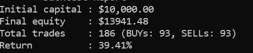
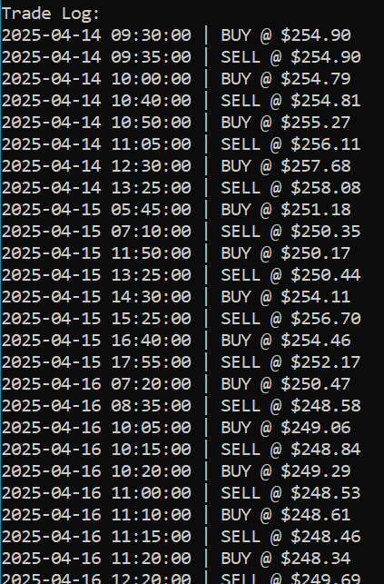
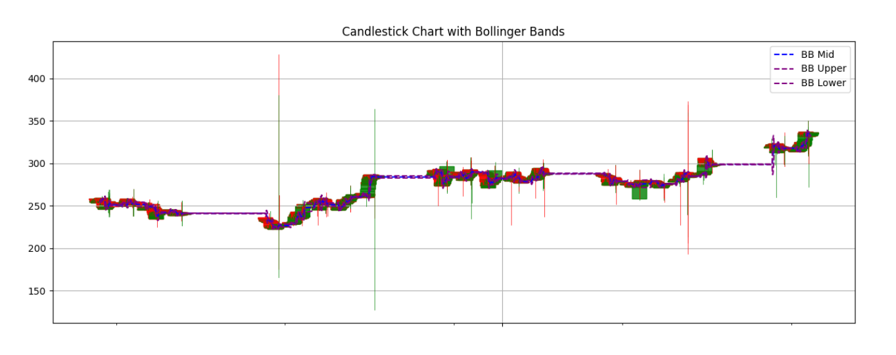
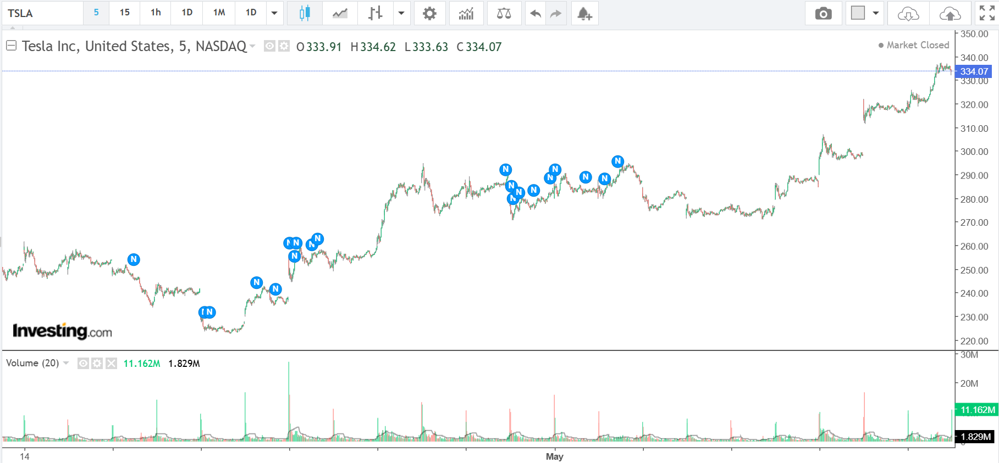

# Stock-Analysis

## 🚀 Key Features

### ✅ CUDA-Accelerated & CPU versions of Technical Indicators
- computation in parallel and sequential of:
  - **EMA** (Exponential Moving Average)
  - **RSI** (Relative Strength Index)
  - **MACD**
  - **Bollinger Bands**
  - **Stochastic Oscillator**
  - **ATR**

- Implemented CUDA kernels to boost performance for large time-series data.

### ✅ Trading Logic
- Simple rule-based buy/sell decisions based on multiple indicator thresholds.
- Portfolio tracking and logging of trade actions and equity value.

### ✅ Data Fetching
- Uses **Alpha Vantage API** to fetch stock data (Open, High, Low, Close, Volume).
- CSV-based logging of input prices and computed signals.
- Python based visualization of all the indicators and trade logs

## 📊 Example Output

- `TSLA_data.csv` - Contains OHLC stock data.
- `indicators.csv` - Includes computed indicators and trade signals.
- `backtest.csv` - Logs portfolio value, executed trades, and timestamps.

## Screenshots

#### The data I considered for this project

